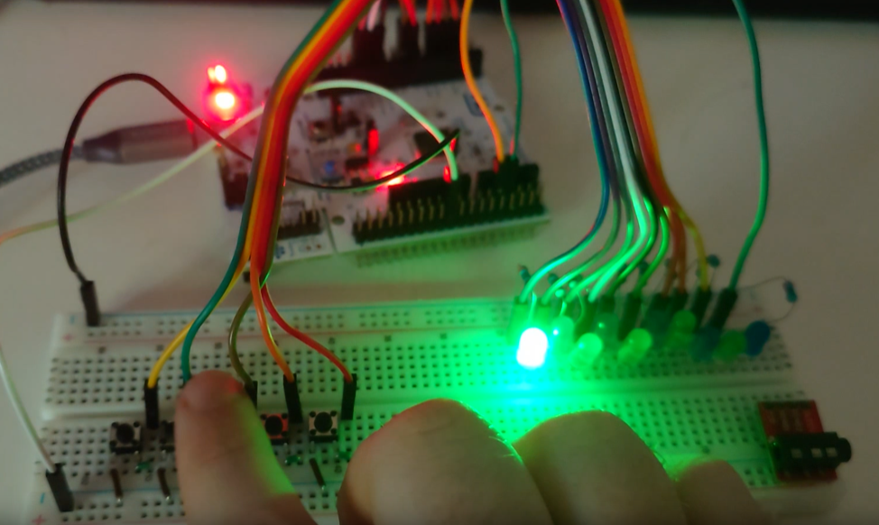
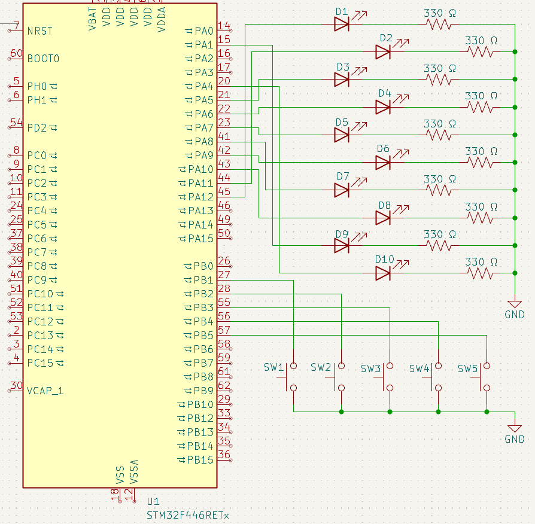

# Elevator Lights Project

A simple Embedded Program to simulate lights on an elevator pannel and the elevator's operation as a user pushes the different buttons to request different floors.

Built on STM32 Nucleo F446RE board

## Video

## Circuit Diagram

## Build Instructions

1. clone or copy the repo to a location on your computer
2. run '''rustup target add thumbv7em-none-eabihf''' to add the embedded target
3. be sure to plug in an appropirate device to build to.
   - you may need to edit the memory.x file if the memory of your device is mapped differently to the nucleo-f446re.
5. run '''cargo run''' and cargo will try and build and run the program on your device
   - note: it won't look like much is going on unless you have the circuit connected properly
